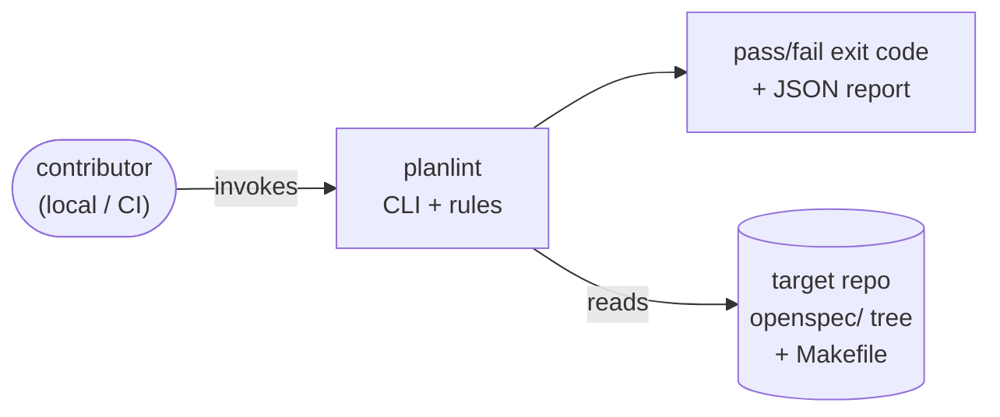
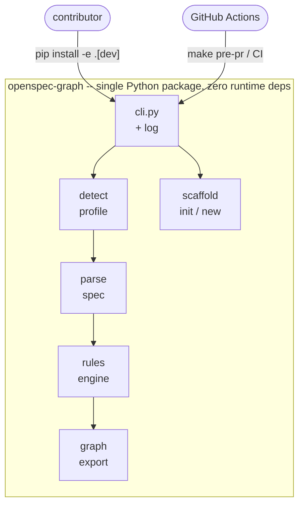
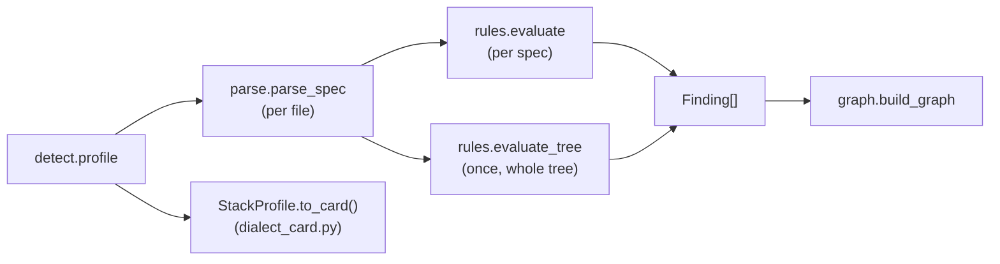

# C4 Architecture — OpenSpec-Graph

A right-sized C4 model for `planlint`, a single-process Python CLI that grafts
an OpenSpec governance discipline onto a cloned repository and enforces it
mechanically. The goal is not autonomous agents — it is deterministic,
auditable rules that turn review prose into CI gates.

## 1. Context (System Context)

**`planlint`** applies a spec discipline to a cloned repository. It reads the
target's `openspec/` tree and detected conventions (Makefile targets, coverage
floor locator, spec dialect), evaluates a fixed rule engine, and emits a
pass/fail result plus a dependency graph. It is invoked locally by contributors
and in CI as a hard gate.

## 2. Container

One container: a dependency-free Python package (`openspec_graph`) plus a
`tools/` directory of CI gate scripts (coverage floors, secret scan, graph
diff, no-hardcoded-threshold check). Dev dependencies (pytest, ruff, mypy) are
optional extras, never required at runtime.

## 3. Component

| Component | Responsibility | Key types |
|---|---|---|
| `cli.py` | Argparse verbs, exit codes, logging setup | `main`, `cmd_*` |
| `detect.py` | Read the target repo's conventions | `StackProfile`, `profile` |
| `machinery.py` | Structural Makefile parser, called by `detect.py`; never shells out to `make` | `MakefileFacts`, `parse_makefile` |
| `dialect_card.py` | CP-2 portable-snapshot schema + diff engine for `detect --format json`/`--diff` | `SCHEMA_VERSION`, `diff_cards` |
| `parse.py` | Facade over the parser submodules (below) | `ParsedSpec`, `Requirement`, `Criterion` |
| `rules.py` | Facade over the rule submodules (below); 20 deterministic rules + waiver handling | `Rule`, `Finding`, `evaluate`, `evaluate_tree` |
| `ledger.py` | Pure aggregation: `ParsedSpec.waivers` → a stable-ordered ledger (CP-4) | `LedgerEntry`, `build_ledger` |
| `mermaid.py` | Pure rendering: `build_graph()`'s dict → a Mermaid flowchart (CP-GV) | `to_mermaid` |
| `scaffold.py` | Write `openspec/` tree + change packages | `plan_init`, `plan_change` |
| `graph.py` | Pure projection of `validate` to a graph | `build_graph` |
| `log.py` | Stderr-only debug logging | `configure`, `level_from` |
| `tools/*` | CI gates (coverage, secrets, diff, thresholds) + `render_mermaid.py` | standalone scripts |

**Data flow:**

`detect.profile` feeds `machinery.parse_makefile` for Makefile targets (falling
back to regex detection on low structural confidence), then every parsed spec
through `rules.evaluate` (per spec) and, once per run, `rules.evaluate_tree`
(whole-tree properties like "a declared invariant is cited by *some* spec"
that no per-spec check can express) — both feed the same `Finding[]`. The
graph is a pure projection of the same `detect` + `parse` +
`rules.evaluate`/`evaluate_tree` calls, so for an unscoped run `broken_links`
equals the finding count (AC-GR-4) — they cannot disagree by construction.
Under `--change` this is a deliberate, documented exception, not a bug:
`validate --change` skips the whole-tree `evaluate_tree()` checks (G006 and
G009) entirely, while `graph --change` always includes them, unscoped,
regardless of what's rendered (DEC-GV-002, generalized to G009 by
DEC-AD-004) — so the two can disagree on a `--change`-scoped run specifically
because of those checks. `StackProfile.to_card()` (`dialect_card.py`'s
schema, shown above as a separate branch off `detect.profile`) is a narrower
projection of the same result — a portable snapshot for `detect --format
json`/`--diff`, not part of the `validate`/`graph` finding pipeline.

## 4. Code (Module map)

Post-`decompose-god-files` (PR #4): the four largest modules were split into
focused submodules behind a stable facade, so external imports (`cli.py`,
tests, `__init__.py`'s public re-exports) are unaffected — only the internal
layout changed.

```mermaid
flowchart TD
    pkg["openspec_graph/"] --> init["__init__.py<br/>public API re-exports"]
    pkg --> cli["cli.py<br/>argparse verbs + logging; exit 0/1/2 contract"]
    pkg --> detect["detect.py<br/>StackProfile: languages, make_targets, dialect, invariants, adrs"]
    pkg --> machinery["machinery.py<br/>structural Makefile parser (CP-3); never shells out to make"]
    pkg --> dialect_card["dialect_card.py<br/>portable snapshot schema + diff engine (CP-2)"]
    pkg --> log["log.py<br/>configure(): stderr handler, level from -v / env var"]
    pkg --> graphmod["graph.py<br/>build_graph(): nodes/edges/broken_links, pure projection"]
    pkg --> mermaidmod["mermaid.py<br/>to_mermaid(): build_graph()'s dict -&gt; a Mermaid flowchart (CP-GV)"]
    pkg --> ledger["ledger.py<br/>build_ledger(): ParsedSpec.waivers -&gt; a stable-ordered ledger (CP-4)"]
    pkg --> parse["parse.py<br/>facade: spec.md -&gt; ParsedSpec"]
    parse --> parse_model["parse_model.py<br/>Criterion / Requirement / ParsedSpec dataclasses"]
    parse --> parse_semantics["parse_semantics.py<br/>shared regex grammar; non-success, hard-threshold, waiver detection"]
    parse --> parse_harness["parse_harness.py<br/>'harness' dialect parser (R-/C- + AC-AREA-n)"]
    parse --> parse_upstream["parse_upstream.py<br/>'upstream' dialect parser (### Requirement / #### Scenario)"]
    pkg --> rules["rules.py<br/>facade: RULES = GENERIC + HARNESS + UPSTREAM"]
    rules --> rule_types["rule_types.py<br/>Finding / Rule dataclasses, ERROR/WARN/INFO"]
    rules --> rules_generic["rules_generic.py<br/>G001-G009 (dialect-agnostic)"]
    rules --> rules_harness["rules_harness.py<br/>H001-H006"]
    rules --> rules_upstream["rules_upstream.py<br/>U001-U005"]
    pkg --> scaffold["scaffold.py<br/>facade: plan_init/plan_change -&gt; WritePlan -&gt; apply"]
    pkg --> scaffold_templates["scaffold_templates.py<br/>pure string templates for generated docs"]
```

`rules_generic.py` covers G001-G009, `rules_harness.py` covers H001-H006, and
`rules_upstream.py` covers U001-U005 — dialect-agnostic vs. per-dialect rule
families under the `rules.py` facade.

### Invariants (load-bearing, not aspirational)

- **`broken_links == len(validate findings)`, for an unscoped run** — the graph
  is a pure projection of `rules.evaluate`/`evaluate_tree`; the two cannot
  disagree by construction outside `--change`. Under `--change` they
  deliberately can: `graph --change` always includes G006/G009's tree-wide
  findings unscoped, while `validate --change` skips both entirely
  (DEC-GV-002, generalized to G009 by DEC-AD-004) — a documented exception
  to this invariant, not a violation of it.
- **Logging never reaches stdout** — `log.py` attaches a stderr handler and
  disables propagation, so `--json` output stays parseable.
- **No hard-coded thresholds** — coverage floors live in `pyproject.toml`,
  `.coveragerc`, or `setup.cfg`; the Makefile and workflow only invoke
  scripts that read them (rule G003).
- **`machinery.py` never shells out to `make`** — structural Makefile
  parsing is text-only (`str`/`re` operations), at any confidence level,
  with no fallback that shells out either. GNU Make evaluates `$(shell ...)`
  calls at parse time unconditionally, so no flag combination makes
  invoking a real `make` safe against an untrusted target repo's Makefile.
  Enforced by a static import guard (`test_machinery_never_imports_subprocess`)
  and a runtime execution test, not just convention.
- **Structural Makefile parsing is linear in input size, even on
  malformed input** — never shelling out is necessary but not sufficient
  for "safe against an untrusted Makefile": an earlier version of
  `define`/`endef` handling used a whole-text regex with unbounded lazy
  matching that was quadratic-time on an unterminated block (32+ seconds
  on a 20K-line adversarial input), found by an independent review before
  merge. `machinery.strip_define_blocks` (shared by `machinery.py` and
  `detect.py`'s legacy fallback, so the two can't independently diverge
  on this handling again) is a single O(n) line-scan instead. Proven by a
  bounded-wall-clock-time test, not asserted from complexity analysis alone.
- **Dialect cards never carry an absolute path** — `StackProfile.to_card()`
  excludes `root` and reduces `openspec_root` to a portable
  `has_openspec_root` boolean, so `detect --format json`/`--diff` (CP-2)
  is byte-identical for the same logical repo checked out at two different
  paths. Proven by a cross-checkout-path test, not just code review.
